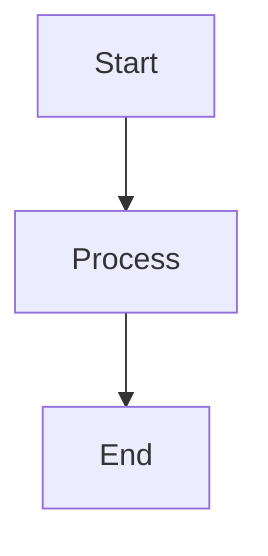

# Markdown Accessibility Review Guidelines

When reviewing or generating markdown files, check for all of the following accessibility issues. Flag violations and suggest fixes with clear explanations of the accessibility impact. These rules extend GitHub's [5 tips for making your GitHub profile page accessible](https://github.blog/developer-skills/github/5-tips-for-making-your-github-profile-page-accessible/) with table, diagram, typographic, and anchor-link rules.

## 1. Descriptive Links (WCAG 2.4.4)

- Flag generic link text: "click here," "here," "this," "read more," "learn more," "link," "view," "see more," "more."
- Link text must make sense when read out of context - assistive technology presents links as an isolated list.
- Flag multiple links on the same page with identical text pointing to different destinations.
- Bare URLs in prose must be converted to descriptive links.
- Do not flag: badge image links, section anchor links using the section name, or links inside code blocks.

Bad: `Read my blog post [here](https://example.com)`
Good: `Read my blog post "[Crafting an accessible resume](https://example.com)"`

## 2. Image Alt Text (WCAG 1.1.1)

- Flag images with empty alt text (``) unless they are explicitly decorative.
- Flag alt text that is a filename (e.g., `img_1234.jpg`) or generic placeholder (`screenshot`, `image`, `photo`).
- Alt text should be succinct and descriptive. Include any text visible in the image.
- Use "screenshot of" where relevant; do not prefix with "image of" as screen readers announce that automatically.
- For complex images (charts, infographics): flag and suggest a `<details>` block with a data summary.
- Always present alt text improvements as recommendations for the author to review - never auto-apply.

## 3. Heading Hierarchy (WCAG 1.3.1 / 2.4.6)

- One H1 (`#`) per document, used as the page title.
- Never skip heading levels: `##` followed by `####` is a violation.
- Flag bold text (`**text**`) used as a visual substitute for a heading.
- Documents with no H1 should have the first major heading promoted.

## 4. Table Accessibility (WCAG 1.3.1)

- Tables without a preceding description or caption are an accessibility gap. Add a one-sentence summary immediately before the table.
- Flag tables where the first column acts as row headers but is not visually distinguishable - suggest bolding first-column cells or restructuring as a definition list.
- Flag tables with more than 6 columns or significant merged-cell complexity - suggest splitting or using a list.
- Tables used for layout (not data) must be replaced with CSS-equivalent structure (lists, paragraphs).
- Do not use `|` pipe characters to create decorative separators outside of table syntax.

Example - add a table summary:
```markdown
The following table lists agents with their role and supported platform.

| Agent | Role | Platform |
|-------|------|----------|
```

## 5. Emoji (WCAG 1.3.3 / Cognitive)

- Flag consecutive emoji sequences (2 or more in a row) - screen readers announce each emoji name in full.
- Flag emoji used as the first character of a list item that acts as a visual bullet.
- Flag emoji in headings - they disrupt landmark navigation for screen reader users.
- Flag emoji that convey meaning not communicated in surrounding text.
- When removing meaning-bearing emoji, preserve the meaning in words.
- Single contextual emoji in body text may be acceptable if meaning is also in text.

## 6. Mermaid Diagrams (WCAG 1.1.1 / 1.3.1)

- Mermaid code blocks render as images on GitHub with no accessible alternative.
- Flag every ` ```mermaid ` block that does not have a text description immediately before it.
- Recommended replacement pattern: add a text description before the block, then wrap the original Mermaid source in a `<details>` element so sighted users retain the visual:

```markdown
The following diagram shows a linear flow: Start leads to Process, then to End.

<details>
<summary>Diagram source (Mermaid)</summary>



</details>
```

- For complex diagrams: flag and ask the author to provide or approve the description.

## 7. Em-Dash and En-Dash Normalization (Cognitive / Readability)

- Em-dashes (`—`, `--` used as em-dash, or `---` in prose) are read inconsistently by screen readers and are harder for users with dyslexia.
- En-dashes (`–`) used as range separators in prose are similarly problematic.
- Recommended fix: replace with ` - ` (space-hyphen-space) in prose.
- Never modify: content inside code blocks or inline code, YAML front matter, HTML comments, or `---` horizontal rules (three hyphens on their own line).

Before: `The process takes 2--4 hours—depending on configuration.`
After: `The process takes 2 - 4 hours - depending on configuration.`

## 8. Anchor Link Validation (WCAG 2.4.4)

- Broken anchor links (`[text](#nonexistent-section)`) silently fail - keyboard and screen reader users are dropped at the top of the page with no error feedback.
- Validate all `[text](#anchor)` links against headings in the same file.
- GitHub anchor generation rules: lowercase everything, replace spaces with hyphens, remove all non-alphanumeric characters except hyphens.
  - `## My Heading` -> `#my-heading`
  - `## API: v2.0` -> `#api-v20`
  - `## What's New?` -> `#whats-new`
- Flag mismatches with a suggested correction. Do not auto-fix the link without confirming which end (link or heading) should change.
- Cross-file anchors (`[text](./other.md#section)`) require manual verification - flag with a note.

## Review Priority

When multiple issues exist, prioritize in this order:

1. Missing or empty alt text on images
2. Mermaid diagrams with no text alternative
3. Broken anchor links
4. Skipped heading levels or missing H1
5. Non-descriptive link text (ambiguous links)
6. Tables without descriptions
7. Emoji used as bullets or in headings
8. Em-dash / en-dash normalization
9. Plain language improvements

## Review Tone

- Explain the accessibility impact of each issue, specifying which users are affected (screen reader users, people with cognitive disabilities, keyboard-only users, non-native speakers).
- Do not remove personality or voice from the writing. Accessibility and engaging content are not mutually exclusive.
- Keep suggestions actionable and specific.
- Never use emoji in your own summaries or explanations.
- Follow proper heading hierarchy in all output (start at h2, increment logically).