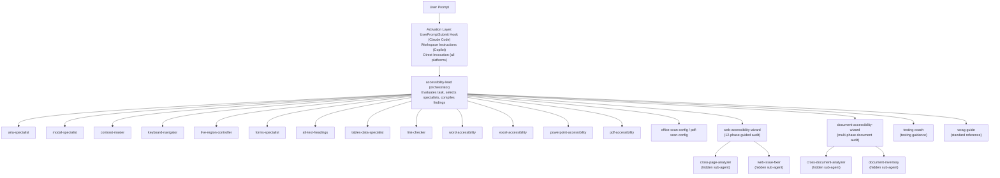
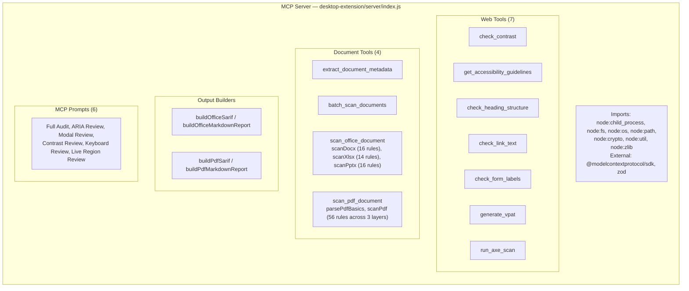
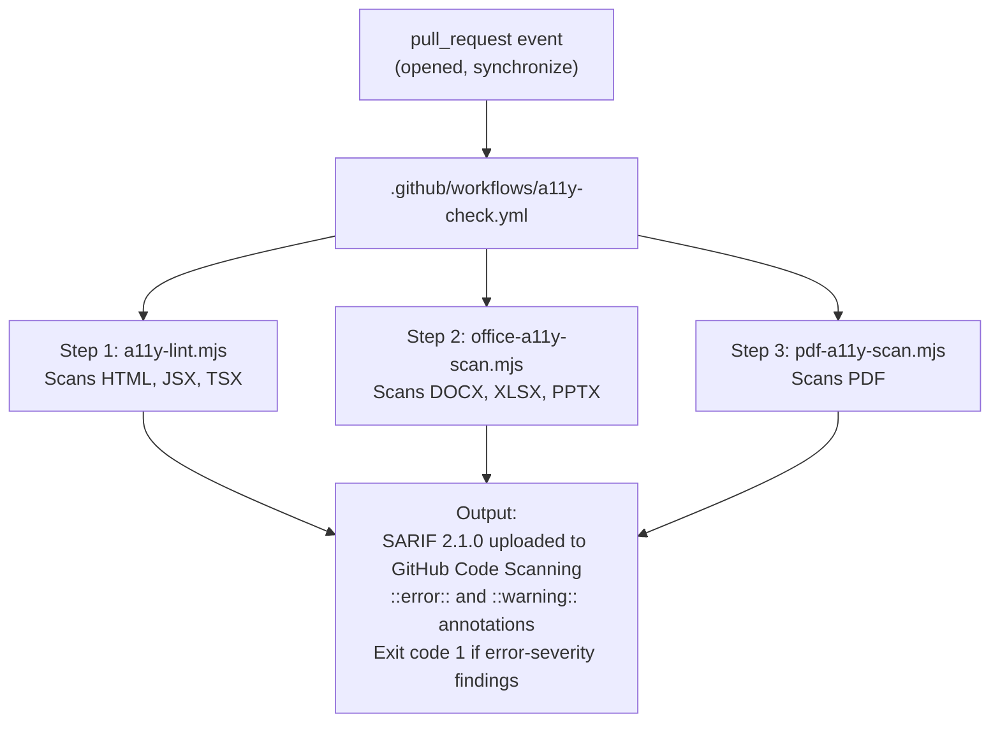

# Product Requirements Document: A11y Agent Team

**Version:** 2.0  
**Author:** Taylor Arndt  
**Last Updated:** 2026-02-22  
**Status:** Active Development (main branch)

---

## Table of Contents

- [Executive Summary](#executive-summary)
- [Problem Statement](#problem-statement)
- [Product Vision](#product-vision)
- [Target Users](#target-users)
- [Platform Support](#platform-support)
- [System Architecture](#system-architecture)
  - [Agent Architecture](#agent-architecture)
  - [MCP Server Architecture](#mcp-server-architecture)
  - [CI/CD Architecture](#cicd-architecture)
- [Agent Specifications](#agent-specifications)
  - [Web Accessibility Agents (13)](#web-accessibility-agents-13)
  - [Document Accessibility Agents (6)](#document-accessibility-agents-6)
  - [Hidden Helper Sub-Agents (5)](#hidden-helper-sub-agents-5)
- [Prompts and Skills](#prompts-and-skills)
  - [Custom Prompts (14)](#custom-prompts-14)
  - [Reusable Skills (6)](#reusable-skills-6)
  - [Lifecycle Hooks (2)](#lifecycle-hooks-2)
  - [Agent Teams (AGENTS.md)](#agent-teams-agentsmd)
- [MCP Tool Specifications](#mcp-tool-specifications)
  - [Web Accessibility Tools (7)](#web-accessibility-tools-7)
  - [Document Accessibility Tools (4)](#document-accessibility-tools-4)
- [Rule Systems](#rule-systems)
  - [Office Document Rules](#office-document-rules)
  - [PDF Document Rules](#pdf-document-rules)
- [CI/CD Integration](#cicd-integration)
- [Configuration System](#configuration-system)
- [Output Formats](#output-formats)
- [Installation and Distribution](#installation-and-distribution)
- [Standards Compliance](#standards-compliance)
- [Non-Functional Requirements](#non-functional-requirements)
- [Dependencies](#dependencies)
- [File Inventory](#file-inventory)
- [Future Roadmap](#future-roadmap)
- [Risks and Mitigations](#risks-and-mitigations)

---

## Executive Summary

A11y Agent Team is an accessibility enforcement system for AI-powered coding and authoring tools. It deploys twenty-four specialized agents across three platforms — Claude Code (terminal), GitHub Copilot (VS Code), and Claude Desktop (app) — to ensure that web code, Office documents, and PDF files meet accessibility standards. The system intercepts the developer workflow at code-generation time, applying WCAG 2.2 AA standards for web content, format-specific rules for Office documents (DOCX/XLSX/PPTX), and PDF/UA conformance with Matterhorn Protocol alignment for PDF files.

The project includes eleven MCP tools (zero external dependencies for document scanning), fourteen custom prompts, six reusable skills, lifecycle hooks, agent team coordination (AGENTS.md), three CI scripts, automated installer/uninstaller scripts for all platforms, auto-update capability, an example project with 20+ intentional violations, and SARIF 2.1.0 output for GitHub Code Scanning integration.

Key capabilities added since v1.0: document accessibility wizard with delta scanning, severity scoring (0-100 with A-F grades), template analysis, remediation tracking, VPAT/ACR export, batch remediation scripts, CI/CD integration guides; web accessibility wizard with sub-agent delegation, page metadata dashboard, component/template analysis, framework intelligence (React, Vue, Angular, Svelte, Tailwind), large crawl handling, interactive fix mode, and web scan configuration files; hidden helper sub-agents for parallel workload distribution; and comprehensive documentation in `docs/`.

---

## Problem Statement

### Core Problem

AI coding tools (Claude Code, GitHub Copilot, Cursor, etc.) generate inaccessible code by default. They:

1. **Forget ARIA rules** — Misuse roles, states, and properties; violate the First Rule of ARIA
2. **Skip keyboard navigation** — Produce interactive elements unreachable by keyboard
3. **Ignore contrast ratios** — Use color combinations that fail WCAG AA thresholds
4. **Break focus management** — Modals without focus trapping, SPAs without focus restoration on route change
5. **Omit live regions** — Dynamic content changes invisible to screen readers
6. **Produce inaccessible documents** — Office files and PDFs without tagged structure, alt text, or proper metadata

### Why Existing Approaches Fail

| Approach | Failure Mode |
|----------|-------------|
| **Skills / Instructions** | Auto-activation rate ~20%. Skills are deprioritized as context grows. Silently ignored. |
| **CLAUDE.md / System Prompts** | Single block of instructions. Accessibility competes with other concerns and gets dropped. |
| **MCP Tools** | Add external checks but don't change how the model reasons during code generation. |
| **Linters (eslint-plugin-jsx-a11y)** | Catch ~30% of issues. Only flag violations after code is written, not during generation. |
| **axe-core** | Tests rendered pages, not source code. Requires a running dev server. Runtime-only. |

### Solution Insight

Agents run in their own context window with a dedicated system prompt. The accessibility rules aren't suggestions — they are the agent's entire identity. An ARIA specialist cannot forget about ARIA. A contrast master cannot skip contrast checks. The rules are who they are.

---

## Product Vision

"Accessibility is how I work, not something I bolt on at the end."

A11y Agent Team makes accessibility enforcement automatic, comprehensive, and unavoidable in AI-assisted development workflows. It covers the full lifecycle — from code generation through document authoring to CI verification — across every major AI coding platform.

### Design Principles

1. **Zero tolerance for silent failures** — Accessibility issues are caught at generation time, not after deployment
2. **Single responsibility per agent** — Each agent owns one domain completely and cannot be distracted
3. **Native platform integration** — Works within each platform's architecture (hooks for Claude Code, workspace instructions for Copilot, MCP for Desktop)
4. **Zero external dependencies for core features** — Document scanning uses only Node.js built-ins
5. **Standards-first** — All rules trace back to specific WCAG criteria, PDF/UA checkpoints, or Matterhorn Protocol requirements
6. **Progressive enforcement** — Configurable rule sets with preset profiles (strict/moderate/minimal)

---

## Target Users

| User Type | Primary Need | Primary Platform |
|-----------|-------------|-----------------|
| **Individual developers** | Ensure personal projects meet WCAG AA | Claude Code (global install) |
| **Web development teams** | Enforce accessibility standards across the team | GitHub Copilot (project install) |
| **Content authors** | Validate Office documents and PDFs for accessibility | Claude Desktop or Copilot |
| **Accessibility specialists** | Audit existing projects, generate VPAT/ACR reports | All platforms |
| **QA engineers** | Integrate accessibility checks into CI pipelines | GitHub Actions CI scripts |
| **Procurement teams** | Verify vendor conformance documentation | Claude Desktop (VPAT generation) |

---

## Platform Support

### Claude Code (Terminal)

- **Agent format:** Markdown files with YAML frontmatter (`tools`, `model`, `description`) in `.claude/agents/`
- **Activation mechanism:** `UserPromptSubmit` hook fires on every prompt; evaluates whether UI code is involved
- **Hook scripts:** Bash (macOS/Linux) and PowerShell (Windows)
- **Install scope:** Project-level (`.claude/`) or global (`~/.claude/`)
- **Auto-updates:** LaunchAgent (macOS), cron (Linux), Task Scheduler (Windows) — daily at 9:00 AM

### GitHub Copilot (VS Code)

- **Agent format:** Markdown files (no YAML frontmatter) in `.github/agents/`
- **Activation mechanism:** Workspace instructions (`.github/copilot-instructions.md`) loaded on every conversation
- **Additional files:** PR review instructions, commit message instructions, PR template, CI workflow, VS Code config
- **Install scope:** Project-level only (per `.github/` convention)

### Claude Desktop (App)

- **Extension format:** `.mcpb` (MCP Bundle) — packaged Node.js server with manifest
- **Activation mechanism:** Tools auto-invoked by Claude; prompts available from prompt picker
- **Distribution:** GitHub Releases download; submitted to Anthropic Connectors Directory
- **MCP SDK:** `@modelcontextprotocol/sdk` ^1.20.0 with `zod` 3.25

---

## System Architecture

### Agent Architecture



### MCP Server Architecture

The MCP server (`desktop-extension/server/index.js`) is a single Node.js ESM module that:

1. Registers 11 tools and 6 prompts with the `@modelcontextprotocol/sdk` `McpServer`
2. Communicates via `StdioServerTransport` (stdin/stdout JSON-RPC)
3. Performs all document scanning with zero external dependencies:
   - **Office scanning:** Pure Node.js ZIP Central Directory parsing using `inflateRawSync` from `node:zlib`
   - **PDF scanning:** Direct buffer parsing using `latin1` encoding with regex-based structure detection
4. Shells out to `@axe-core/cli` only for the `run_axe_scan` tool (optional external dependency)



### CI/CD Architecture



---

## Agent Specifications

### Web Accessibility Agents (13)

| # | Agent | Domain | Rule Coverage | Writes Code? |
|---|-------|--------|---------------|-------------|
| 1 | **accessibility-lead** | Orchestration | All (via delegation) | No (delegates) |
| 2 | **aria-specialist** | ARIA roles, states, properties | WAI-ARIA 1.2 | Yes |
| 3 | **modal-specialist** | Dialogs, drawers, overlays | Focus trap, escape, inert | Yes |
| 4 | **contrast-master** | Color contrast, dark mode, focus indicators, prefers-* | WCAG 1.4.3, 1.4.6, 1.4.11 | Yes |
| 5 | **keyboard-navigator** | Tab order, focus management, skip links | WCAG 2.1.1, 2.1.2, 2.4.3, 2.4.7 | Yes |
| 6 | **live-region-controller** | Dynamic content announcements | aria-live, role=alert, timing | Yes |
| 7 | **forms-specialist** | Labels, validation, errors, autocomplete | WCAG 1.3.1, 1.3.5, 3.3.1, 3.3.2 | Yes |
| 8 | **alt-text-headings** | Alt text, SVGs, headings, landmarks, page titles | WCAG 1.1.1, 1.3.1, 2.4.1, 2.4.2, 2.4.6 | Yes |
| 9 | **tables-data-specialist** | Data tables, grids, sortable columns | WCAG 1.3.1 | Yes |
| 10 | **link-checker** | Ambiguous link text, new-tab warnings, file types | WCAG 2.4.4, 2.4.9 | Yes |
| 11 | **web-accessibility-wizard** | Multi-phase guided web audit (12 phases) with sub-agent delegation, severity scoring, framework intelligence, VPAT/ACR export, batch scripts, CI/CD guides, delta scanning, fix mode | All (via delegation) | No (delegates) |
| 12 | **testing-coach** | Screen reader testing, keyboard testing, CI testing | Teaching only | No (test code only) |
| 13 | **wcag-guide** | WCAG 2.0/2.1/2.2 criteria explanation | All WCAG criteria | No (reference only) |

### Document Accessibility Agents (6)

| # | Agent | Domain | Rule Count | MCP Tool |
|---|-------|--------|-----------|----------|
| 14 | **word-accessibility** | DOCX alt text, headings, tables, language, reading order | 16 rules | scan_office_document |
| 15 | **excel-accessibility** | XLSX sheet names, merged cells, headers, charts, defined names | 14 rules | scan_office_document |
| 16 | **powerpoint-accessibility** | PPTX slide titles, reading order, alt text, media, notes | 16 rules | scan_office_document |
| 17 | **office-scan-config** | Office scan configuration management | 3 presets | N/A (config only) |
| 18 | **pdf-accessibility** | PDF/UA conformance, Matterhorn Protocol, structure, metadata | 56 rules (3 layers) | scan_pdf_document |
| 19 | **pdf-scan-config** | PDF scan configuration management | 3 presets | N/A (config only) |

### Hidden Helper Sub-Agents (5)

These agents are not user-invokable. They are used internally by the document-accessibility-wizard and web-accessibility-wizard to parallelize scanning and analysis.

| # | Agent | Parent Wizard | Purpose | Platforms |
|---|-------|--------------|---------|----------|
| 20 | **cross-page-analyzer** | web-accessibility-wizard | Cross-page web pattern detection, severity scoring, remediation tracking | Claude + Copilot |
| 21 | **web-issue-fixer** | web-accessibility-wizard | Automated and guided web accessibility fix application | Claude + Copilot |
| 22 | **cross-document-analyzer** | document-accessibility-wizard | Cross-document pattern detection, severity scoring, template analysis | Claude + Copilot |
| 23 | **document-inventory** | document-accessibility-wizard | File discovery, inventory building, delta detection across folders | Claude + Copilot |

> **Note:** The accessibility-lead agent (#1) also serves as the 24th agent per platform. The document-accessibility-wizard is listed as a distinct agent but shares the same count slot as #14 in the document agents section above — the hidden sub-agents bring the total to 24 unique agents per platform.

---

## Prompts and Skills

### Custom Prompts (14)

One-click workflows available from the Copilot prompt picker:

#### Document Accessibility Prompts (9)

| Prompt | What It Does |
|--------|-------------|
| audit-single-document | Scan a single .docx, .xlsx, .pptx, or .pdf with severity scoring |
| audit-document-folder | Recursively scan an entire folder of documents |
| audit-changed-documents | Delta scan — only audit documents changed since last commit |
| generate-vpat | Generate a VPAT 2.5 / ACR compliance report from audit results |
| generate-remediation-scripts | Create PowerShell/Bash scripts to batch-fix common issues |
| compare-audits | Compare two audit reports to track remediation progress |
| setup-document-cicd | Set up CI/CD pipelines for automated document scanning |
| quick-document-check | Fast triage — errors only, pass/fail verdict |
| create-accessible-template | Guidance for creating accessible document templates |

#### Web Accessibility Prompts (5)

| Prompt | What It Does |
|--------|-------------|
| audit-web-page | Full single-page audit with axe-core scan and code review |
| quick-web-check | Fast axe-core triage — runtime scan only, pass/fail verdict |
| audit-web-multi-page | Multi-page comparison audit with cross-page pattern detection |
| compare-web-audits | Compare two web audit reports to track remediation progress |
| fix-web-issues | Interactive fix mode — auto-fixable and human-judgment items from audit report |

### Reusable Skills (6)

Domain-specific knowledge modules in `.github/skills/` that agents reference automatically:

| Skill | Domain |
|-------|--------|
| accessibility-rules | Cross-format document accessibility rule reference with WCAG 2.2 mapping |
| document-scanning | File discovery commands, delta detection, scan configuration profiles |
| report-generation | Audit report formatting, severity scoring formulas, VPAT/ACR compliance export |
| web-scanning | Web content discovery, URL crawling, axe-core CLI commands, framework detection |
| web-severity-scoring | Web severity scoring formulas (0-100, A-F grades), confidence levels, remediation tracking |
| framework-accessibility | Framework-specific accessibility patterns and fix templates (React, Vue, Angular, Svelte, Tailwind) |

### Lifecycle Hooks (2)

| Hook | When | Purpose |
|------|------|--------|
| SessionStart | Beginning of session | Auto-detects scan config files and previous audit reports; injects relevant context |
| SessionEnd | End of session | Quality gate — validates audit report completeness and prompts for missing sections |

### Agent Teams (AGENTS.md)

Team coordination is defined in `.github/agents/AGENTS.md`. Three defined teams:

| Team | Led By | Members |
|------|--------|--------|
| Document Accessibility Audit | document-accessibility-wizard | word-accessibility, excel-accessibility, powerpoint-accessibility, pdf-accessibility, document-inventory, cross-document-analyzer |
| Web Accessibility Audit | accessibility-lead | All 13 web agents + cross-page-analyzer, web-issue-fixer |
| Full Audit | accessibility-lead | All agents (combined web + document workflow) |

---

## MCP Tool Specifications

### Web Accessibility Tools (7)

#### check_contrast

| Property | Value |
|----------|-------|
| **Input** | `foreground` (hex), `background` (hex) |
| **Output** | Ratio, AA pass/fail for normal text (4.5:1), large text (3:1), UI components (3:1) |
| **Algorithm** | WCAG relative luminance formula |
| **Dependencies** | None |

#### get_accessibility_guidelines

| Property | Value |
|----------|-------|
| **Input** | `componentType` (enum: modal, tabs, accordion, combobox, carousel, form, live-region, navigation, general) |
| **Output** | Requirements, code examples, common mistakes per component type |
| **Dependencies** | None |

#### check_heading_structure

| Property | Value |
|----------|-------|
| **Input** | `html` (string) |
| **Output** | Heading outline, multiple H1 detection, skipped levels, empty headings |
| **WCAG Criteria** | 1.3.1, 2.4.6 |
| **Dependencies** | None |

#### check_link_text

| Property | Value |
|----------|-------|
| **Input** | `html` (string) |
| **Output** | 17 ambiguous patterns, URL-as-text, missing new-tab warnings, non-HTML resources, repeated text |
| **WCAG Criteria** | 2.4.4, 2.4.9 |
| **Dependencies** | None |

#### check_form_labels

| Property | Value |
|----------|-------|
| **Input** | `html` (string) |
| **Output** | Missing labels, broken aria-labelledby refs, missing autocomplete, fieldset/legend violations |
| **WCAG Criteria** | 1.3.1, 1.3.5, 3.3.2, 4.1.2 |
| **Dependencies** | None |

#### generate_vpat

| Property | Value |
|----------|-------|
| **Input** | `productName`, `productVersion`, `evaluationDate`, optional `findings[]`, optional `reportPath` |
| **Output** | VPAT 2.5 template with all WCAG 2.2 Level A (30) and AA (20) criteria |
| **Format** | Markdown |
| **Dependencies** | None |

#### run_axe_scan

| Property | Value |
|----------|-------|
| **Input** | `url` (required), optional `selector` (CSS), optional `reportPath` |
| **Output** | Violations grouped by severity with affected elements, WCAG criteria, and fix suggestions |
| **Format** | Markdown report when reportPath provided |
| **Dependencies** | `@axe-core/cli` (external, must be installed separately) |

### Document Accessibility Tools (4)

#### extract_document_metadata

| Property | Value |
|----------|-------|
| **Input** | `filePath` (string) |
| **Supported Formats** | DOCX, XLSX, PPTX, PDF |
| **Output** | Title, author, language, creation date, page/slide/sheet count, word count, tagged status (PDF) |
| **Dependencies** | None (pure Node.js) |

#### batch_scan_documents

| Property | Value |
|----------|-------|
| **Input** | `directoryPath` (string), optional `recursive` (boolean), optional `formats` (string[]), optional `outputFormat` (sarif\|markdown) |
| **Behavior** | Scans all matching documents in a directory, aggregates results |
| **Output** | Combined SARIF or markdown report with per-file results |
| **Dependencies** | None (pure Node.js) |

#### scan_office_document

| Property | Value |
|----------|-------|
| **Input** | `filePath` (string), optional `outputFormat` (sarif\|markdown, default: sarif) |
| **Supported Formats** | DOCX, XLSX, PPTX (detected by file extension) |
| **Parsing** | Pure Node.js ZIP Central Directory parsing, `inflateRawSync` for deflate entries |
| **XML Processing** | Custom regex-based XML helpers (`xmlText`, `xmlAttr`, `xmlHas`, `xmlCount`) |
| **Rule Engine** | Per-format scanners: `scanDocx()` (16 rules), `scanXlsx()` (14 rules), `scanPptx()` (16 rules) |
| **Config** | `.a11y-office-config.json` — per-format `enabled`, `disabledRules`, `severityFilter` |
| **Config Search** | Upward directory traversal from scanned file |
| **Output** | SARIF 2.1.0 or human-readable markdown |
| **Dependencies** | None (pure Node.js) |

#### scan_pdf_document

| Property | Value |
|----------|-------|
| **Input** | `filePath` (string), optional `outputFormat` (sarif\|markdown, default: sarif) |
| **Parsing** | Direct buffer reading with `latin1` encoding, regex-based PDF object detection |
| **Structure Detection** | StructTreeRoot, MarkInfo, /Title, /Lang, /Outlines, AcroForm, /Link, /Figure, /Table, /Font, /Encrypt |
| **Rule Engine** | `scanPdf()` with 3 layers: PDFUA.* (30), PDFBP.* (22), PDFQ.* (4) — total 56 rules |
| **Config** | `.a11y-pdf-config.json` — `enabled`, `disabledRules`, `severityFilter`, `maxFileSize` |
| **Config Search** | Upward directory traversal from scanned file |
| **Output** | SARIF 2.1.0 or human-readable markdown |
| **Dependencies** | None (pure Node.js) |

---

## Rule Systems

### Office Document Rules

#### DOCX Rules (16)

| Rule ID | Severity | Description |
|---------|----------|-------------|
| DOCX-E001 | error | Image without alt text |
| DOCX-E002 | error | Missing document title in properties |
| DOCX-E003 | error | No headings used for document structure |
| DOCX-E004 | error | Table without header row |
| DOCX-E005 | error | Missing document language |
| DOCX-E006 | error | Color-only formatting conveying meaning (Bold+Color but no other semantic indicator) |
| DOCX-E007 | error | Inline image without alt text |
| DOCX-W001 | warning | Alt text exceeds 125 characters (may need summarization) |
| DOCX-W002 | warning | Heading levels skipped (e.g., H1 → H3) |
| DOCX-W003 | warning | Table contains merged cells |
| DOCX-W004 | warning | Font size below 10pt |
| DOCX-W005 | warning | Empty paragraphs used for spacing |
| DOCX-W006 | warning | Floating/anchored image may break reading order |
| DOCX-T001 | tip | Consider adding a table of contents for long documents |
| DOCX-T002 | tip | Consider adding document summary/description in properties |
| DOCX-T003 | tip | Consider adding bookmarks for key sections |

#### XLSX Rules (14)

| Rule ID | Severity | Description |
|---------|----------|-------------|
| XLSX-E001 | error | Default sheet name (Sheet1, Sheet2, etc.) |
| XLSX-E002 | error | No defined names for data ranges |
| XLSX-E003 | error | Merged cells present (confuse screen reader navigation) |
| XLSX-E004 | error | No sheet tab color differentiation |
| XLSX-E005 | error | No header row in first-row data detection |
| XLSX-E006 | error | Chart without alt text or description |
| XLSX-W001 | warning | Blank cells found in data ranges |
| XLSX-W002 | warning | Very wide rows (beyond column Z) |
| XLSX-W003 | warning | Hidden sheets may contain important content |
| XLSX-W004 | warning | Data validation cells without input messages |
| XLSX-W005 | warning | No print titles set for multi-page spreadsheets |
| XLSX-T001 | tip | Consider adding a summary/instructions sheet |
| XLSX-T002 | tip | Consider using named ranges for key data areas |
| XLSX-T003 | tip | Consider adding cell comments for complex formulas |

#### PPTX Rules (16)

| Rule ID | Severity | Description |
|---------|----------|-------------|
| PPTX-E001 | error | Slide without title |
| PPTX-E002 | error | Image without alt text |
| PPTX-E003 | error | Missing reading order (no `<p:cNvPr>` with order attributes) |
| PPTX-E004 | error | Table without header row |
| PPTX-E005 | error | Audio/video without text description |
| PPTX-E006 | error | Missing presentation language |
| PPTX-W001 | warning | Multiple slides with identical titles |
| PPTX-W002 | warning | Font size below 18pt (readability on slides) |
| PPTX-W003 | warning | Excessive text on a single slide |
| PPTX-W004 | warning | Missing speaker notes |
| PPTX-W005 | warning | Slide transitions without user control |
| PPTX-W006 | warning | Grouped shapes without group alt text |
| PPTX-T001 | tip | Consider adding slide numbers |
| PPTX-T002 | tip | Consider adding a summary slide |
| PPTX-T003 | tip | Consider high-contrast color scheme for projectors |
| PPTX-T004 | tip | Consider handout version with full text of visual content |

### PDF Document Rules

#### PDFUA Layer — PDF/UA Conformance (30 rules)

| Rule ID | Severity | Matterhorn Checkpoint | Description |
|---------|----------|----------------------|-------------|
| PDFUA.TAGS.001 | error | 01-004 | Document has no tagged structure (no StructTreeRoot) |
| PDFUA.TAGS.002 | error | 01-005 | Document not marked as tagged (MarkInfo missing or false) |
| PDFUA.TAGS.003 | warning | 01-006 | Suspect flag is true (may contain untagged content) |
| PDFUA.TAGS.004 | error | 01-007 | Figure tag without /Alt text |
| PDFUA.TAGS.005 | error | 06-001 | Table tag without /TH header cells |
| PDFUA.TAGS.006 | warning | 01-008 | No /P (paragraph) tags found |
| PDFUA.TAGS.007 | warning | 09-001 | No /L (list) tags found |
| PDFUA.TAGS.008 | warning | 09-002 | No /LI (list item) tags found |
| PDFUA.TAGS.009 | error | 19-001 | No /H (heading) tags found |
| PDFUA.TAGS.010 | warning | 14-001 | No /Sect (section) tags found |
| PDFUA.TAGS.011 | warning | 01-009 | No /Span tags found |
| PDFUA.TAGS.012 | warning | 01-010 | No /Link tags found in document with links |
| PDFUA.TAGS.013 | error | 06-002 | Table without /TR (row) tags |
| PDFUA.TAGS.014 | error | 06-003 | Table without /TD (cell) tags |
| PDFUA.TAGS.015 | warning | 19-002 | Only one heading level used |
| PDFUA.META.001 | error | 28-002 | Missing document title in metadata |
| PDFUA.META.002 | error | 28-004 | Missing document language |
| PDFUA.META.003 | error | 28-005 | DisplayDocTitle not set to true |
| PDFUA.META.004 | warning | 28-006 | Missing document author |
| PDFUA.META.005 | warning | 28-007 | Missing document subject/description |
| PDFUA.META.006 | warning | 28-008 | Missing document keywords |
| PDFUA.META.007 | warning | 28-009 | Missing creation date |
| PDFUA.NAV.001 | warning | 21-001 | No bookmarks (Outlines) present |
| PDFUA.NAV.002 | error | 21-002 | Real-content with no associated tag |
| PDFUA.FORM.001 | error | 25-001 | Form field without /TU (tooltip/label) |
| PDFUA.FORM.002 | warning | 25-002 | Form field without /TM (mapping name) |
| PDFUA.FORM.003 | warning | 25-003 | No tab order set on form fields |
| PDFUA.FONT.001 | error | 26-001 | Non-embedded font detected |
| PDFUA.FONT.002 | warning | 26-002 | No /ToUnicode map for font (glyph-to-text mapping) |
| PDFUA.FONT.003 | warning | 26-003 | Type3 font detected (may cause rendering issues) |

#### PDFBP Layer — Best Practices (22 rules)

| Rule ID | Severity | Description |
|---------|----------|-------------|
| PDFBP.META.001 | warning | Document title matches filename (likely default) |
| PDFBP.META.002 | tip | Missing PDF/UA identifier in metadata |
| PDFBP.META.003 | tip | Missing XMP metadata stream |
| PDFBP.NAV.001 | tip | Consider adding named destinations for navigation |
| PDFBP.NAV.002 | warning | No page labels defined |
| PDFBP.NAV.003 | tip | Consider adding article threads for multi-column content |
| PDFBP.TAGS.001 | warning | High figure-to-text ratio (may be image-heavy) |
| PDFBP.TAGS.002 | tip | Consider adding /Caption to tables |
| PDFBP.TAGS.003 | tip | Consider using /Aside for sidebar content |
| PDFBP.TAGS.004 | warning | No /Note or /Reference tags for footnotes if applicable |
| PDFBP.TAGS.005 | tip | Consider /Annot tags for annotations |
| PDFBP.TEXT.001 | warning | No /ActualText attributes found |
| PDFBP.TEXT.002 | warning | No /E (expansion) attributes for abbreviations |
| PDFBP.TEXT.003 | tip | Consider /Lang override on foreign-language spans |
| PDFBP.FORM.001 | tip | Consider adding /V (default value) hints for form fields |
| PDFBP.FORM.002 | tip | Consider grouping related form fields |
| PDFBP.LINK.001 | warning | Link annotation without /Contents or /Alt |
| PDFBP.LINK.002 | tip | Consider adding link destination descriptions |
| PDFBP.IMG.001 | warning | Large image without /Alt (likely meaningful content) |
| PDFBP.IMG.002 | tip | Consider adding /ActualText for decorative images |
| PDFBP.A11Y.001 | tip | Consider embedding accessibility conformance identifier |
| PDFBP.A11Y.002 | tip | Consider adding a document summary in XMP |

#### PDFQ Layer — Quality / Pipeline (4 rules)

| Rule ID | Severity | Description |
|---------|----------|-------------|
| PDFQ.SIZE.001 | warning | File exceeds configured size limit (default 100MB) |
| PDFQ.SCAN.001 | warning | Suspect scanned-image PDF (no text content, all images) |
| PDFQ.ENC.001 | error | Encryption restricts content access (may block AT) |
| PDFQ.VER.001 | tip | PDF version older than 1.7 (limited tag support) |

---

## CI/CD Integration

### Scripts

| Script | Format | Input | Config File |
|--------|--------|-------|-------------|
| `a11y-lint.mjs` | HTML, JSX, TSX | File/directory paths | None |
| `office-a11y-scan.mjs` | DOCX, XLSX, PPTX | File/directory paths | `.a11y-office-config.json` |
| `pdf-a11y-scan.mjs` | PDF | File/directory paths | `.a11y-pdf-config.json` |

### Common Behavior

All three CI scripts:
- Accept file paths or directory paths as CLI arguments (default: current directory)
- Skip `node_modules`, `.git`, `vendor`, and `dist` directories
- Emit `::error::` and `::warning::` GitHub Actions annotations
- Output SARIF 2.1.0 files for upload to GitHub Code Scanning
- Exit code 0 on success, 1 on error-severity findings

### GitHub Actions Workflow

The `.github/workflows/a11y-check.yml` workflow triggers on `pull_request` events (opened, synchronize) and runs all three scripts.

---

## Configuration System

### Office Configuration (`.a11y-office-config.json`)

```json
{
  "docx": {
    "enabled": true,
    "disabledRules": ["DOCX-W005"],
    "severityFilter": ["error", "warning"]
  },
  "xlsx": {
    "enabled": true,
    "disabledRules": [],
    "severityFilter": ["error", "warning", "tip"]
  },
  "pptx": {
    "enabled": true,
    "disabledRules": [],
    "severityFilter": ["error", "warning"]
  }
}
```

| Field | Type | Description |
|-------|------|-------------|
| `[format].enabled` | boolean | Enable/disable scanning for this format |
| `[format].disabledRules` | string[] | Rule IDs to suppress |
| `[format].severityFilter` | string[] | Severity levels to include in output |

### PDF Configuration (`.a11y-pdf-config.json`)

```json
{
  "enabled": true,
  "disabledRules": [],
  "severityFilter": ["error", "warning"],
  "maxFileSize": 104857600
}
```

| Field | Type | Description |
|-------|------|-------------|
| `enabled` | boolean | Enable/disable PDF scanning |
| `disabledRules` | string[] | Rule IDs to suppress |
| `severityFilter` | string[] | Severity levels to include |
| `maxFileSize` | number | Maximum file size in bytes (default 100MB) |

### Preset Profiles

Both config agents support three preset profiles:

| Profile | Error | Warning | Tip | Description |
|---------|-------|---------|-----|-------------|
| **strict** | Yes | Yes | Yes | All rules, all severities |
| **moderate** | Yes | Yes | No | All rules, errors + warnings only |
| **minimal** | Yes | No | No | Errors only |

### Config Resolution

Both tools search upward from the scanned file's directory to find the nearest config file. This enables:
- Project-wide defaults at the repo root
- Directory-specific overrides (e.g., stricter rules for `legal/` documents)

---

## Output Formats

### SARIF 2.1.0

All document scanning tools and CI scripts output [SARIF 2.1.0](https://docs.oasis-open.org/sarif/sarif/v2.1.0/sarif-v2.1.0.html) (Static Analysis Results Interchange Format):

- Compatible with GitHub Code Scanning
- Includes `tool.driver.name`, `tool.driver.version`, `tool.driver.rules[]`
- Each rule has `id`, `shortDescription`, `defaultConfiguration.level`
- Results include `ruleId`, `level`, `message.text`, `locations[].physicalLocation`
- URI base IDs resolve relative to the workspace root

### Markdown Reports

Human-readable reports include:
- Scan metadata (file, date, tool version)
- Summary table (counts by severity)
- Findings grouped by severity (error → warning → tip)
- Rule explanations and remediation guidance
- Actionable fix descriptions per finding

### VPAT 2.5

The `generate_vpat` tool outputs a full VPAT 2.5 / ACR template:
- All WCAG 2.2 Level A (30 criteria) and Level AA (20 criteria)
- Conformance levels: Supports, Partially Supports, Does Not Support, Not Applicable, Not Evaluated
- Terms and definitions section
- Summary statistics

---

## Installation and Distribution

### Installers

| File | Platform | Description |
|------|----------|-------------|
| `install.sh` | macOS/Linux | Interactive installer (--global / --project flags) |
| `install.ps1` | Windows | Interactive installer (PowerShell) |
| `uninstall.sh` | macOS/Linux | Clean removal including auto-update jobs |
| `uninstall.ps1` | Windows | Clean removal including Task Scheduler jobs |
| `update.sh` | macOS/Linux | Manual or auto-update (git pull + copy) |
| `update.ps1` | Windows | Manual or auto-update |

### Auto-Update Mechanisms

| Platform | Mechanism | Schedule |
|----------|-----------|----------|
| macOS | LaunchAgent plist | Daily 9:00 AM |
| Linux | Cron job | Daily 9:00 AM |
| Windows | Task Scheduler | Daily 9:00 AM |

### Claude Desktop Distribution

- **Current:** Manual download from GitHub Releases (`.mcpb` file, double-click to install)
- **Pending:** Submitted to Anthropic Connectors Directory for automatic updates

### MCP Extension Build

```bash
npm install -g @anthropic-ai/mcpb
cd desktop-extension
npm install
mcpb validate .
mcpb pack . ../a11y-agent-team.mcpb
```

---

## Standards Compliance

| Standard | Coverage | Notes |
|----------|----------|-------|
| **WCAG 2.2 Level A** | 30 criteria (all) | Via web agents and VPAT generation |
| **WCAG 2.2 Level AA** | 20 criteria (all) | Via web agents and VPAT generation |
| **WCAG 2.2 Level AAA** | Not targeted | Available via wcag-guide for reference only |
| **WAI-ARIA 1.2** | Full | Via aria-specialist agent |
| **PDF/UA (ISO 14289)** | 30 conformance rules | Via PDFUA rule layer |
| **Matterhorn Protocol** | Mapped checkpoints | PDFUA rules reference MP checkpoint numbers |
| **Section 508** | Covered via WCAG AA | VPAT 2.5 format supports Section 508 reporting |
| **EN 301 549** | Covered via WCAG AA | European accessibility standard |

---

## Non-Functional Requirements

### Performance

- Office document scanning: < 2 seconds for documents under 10MB
- PDF document scanning: < 3 seconds for documents under 50MB
- All web MCP tools: < 500ms (no I/O except check_contrast calculation)
- `run_axe_scan`: Depends on page complexity and Chromium startup time

### Reliability

- Zero external dependencies for document scanning (pure Node.js)
- Graceful handling of malformed ZIP files, corrupt PDFs, and unexpected XML structures
- Config file parsing failures fall back to default (scan everything) rather than crashing

### Compatibility

- Node.js 18+ (ESM modules, `inflateRawSync`, `randomUUID`)
- Claude Code CLI (any version with agents support)
- GitHub Copilot (any version with `.github/agents/` support)
- Claude Desktop 0.10.0+
- Windows (PowerShell 5.1+), macOS, Linux

### Security

- No network calls during document scanning (purely local file parsing)
- No credential storage
- Config files contain only rule configuration, no secrets
- SARIF output does not include document content, only structural findings

---

## Dependencies

### Runtime Dependencies

| Package | Version | Purpose |
|---------|---------|---------|
| `@modelcontextprotocol/sdk` | ^1.20.0 | MCP server framework |
| `zod` | 3.25 | Input validation and schema definition |

### Optional Runtime Dependencies

| Package | Version | Purpose |
|---------|---------|---------|
| `@axe-core/cli` | Any | Required only for `run_axe_scan` tool |

### Node.js Built-in Modules Used

| Module | Usage |
|--------|-------|
| `node:child_process` | Shell out to axe-core CLI |
| `node:fs/promises` | File I/O (read documents, write reports) |
| `node:os` | Temp directory for axe-core results |
| `node:path` | Path manipulation, extension detection |
| `node:crypto` | `randomUUID()` for SARIF run IDs |
| `node:util` | `promisify()` for child_process |
| `node:zlib` | `inflateRawSync()` for ZIP deflate entries |

---

## File Inventory

### Agent Files (48 total: 24 Claude + 24 Copilot)

| Agent | Claude Path | Copilot Path |
|-------|------------|--------------|
| accessibility-lead | `.claude/agents/accessibility-lead.md` | `.github/agents/accessibility-lead.agent.md` |
| alt-text-headings | `.claude/agents/alt-text-headings.md` | `.github/agents/alt-text-headings.agent.md` |
| aria-specialist | `.claude/agents/aria-specialist.md` | `.github/agents/aria-specialist.agent.md` |
| contrast-master | `.claude/agents/contrast-master.md` | `.github/agents/contrast-master.agent.md` |
| cross-document-analyzer | `.claude/agents/cross-document-analyzer.md` | `.github/agents/cross-document-analyzer.agent.md` |
| cross-page-analyzer | `.claude/agents/cross-page-analyzer.md` | `.github/agents/cross-page-analyzer.agent.md` |
| document-accessibility-wizard | `.claude/agents/document-accessibility-wizard.md` | `.github/agents/document-accessibility-wizard.agent.md` |
| document-inventory | `.claude/agents/document-inventory.md` | `.github/agents/document-inventory.agent.md` |
| excel-accessibility | `.claude/agents/excel-accessibility.md` | `.github/agents/excel-accessibility.agent.md` |
| forms-specialist | `.claude/agents/forms-specialist.md` | `.github/agents/forms-specialist.agent.md` |
| keyboard-navigator | `.claude/agents/keyboard-navigator.md` | `.github/agents/keyboard-navigator.agent.md` |
| link-checker | `.claude/agents/link-checker.md` | `.github/agents/link-checker.agent.md` |
| live-region-controller | `.claude/agents/live-region-controller.md` | `.github/agents/live-region-controller.agent.md` |
| modal-specialist | `.claude/agents/modal-specialist.md` | `.github/agents/modal-specialist.agent.md` |
| office-scan-config | `.claude/agents/office-scan-config.md` | `.github/agents/office-scan-config.agent.md` |
| pdf-accessibility | `.claude/agents/pdf-accessibility.md` | `.github/agents/pdf-accessibility.agent.md` |
| pdf-scan-config | `.claude/agents/pdf-scan-config.md` | `.github/agents/pdf-scan-config.agent.md` |
| powerpoint-accessibility | `.claude/agents/powerpoint-accessibility.md` | `.github/agents/powerpoint-accessibility.agent.md` |
| tables-data-specialist | `.claude/agents/tables-data-specialist.md` | `.github/agents/tables-data-specialist.agent.md` |
| testing-coach | `.claude/agents/testing-coach.md` | `.github/agents/testing-coach.agent.md` |
| wcag-guide | `.claude/agents/wcag-guide.md` | `.github/agents/wcag-guide.agent.md` |
| web-accessibility-wizard | `.claude/agents/web-accessibility-wizard.md` | `.github/agents/web-accessibility-wizard.agent.md` |
| web-issue-fixer | `.claude/agents/web-issue-fixer.md` | `.github/agents/web-issue-fixer.agent.md` |
| word-accessibility | `.claude/agents/word-accessibility.md` | `.github/agents/word-accessibility.agent.md` |

### Infrastructure Files

| File | Purpose |
|------|---------|
| `.claude/hooks/a11y-team-eval.sh` | UserPromptSubmit hook (macOS/Linux) |
| `.claude/hooks/a11y-team-eval.ps1` | UserPromptSubmit hook (Windows) |
| `.claude/settings.json` | Example hook configuration |
| `.github/copilot-instructions.md` | Workspace accessibility instructions |
| `.github/copilot-review-instructions.md` | PR review accessibility rules |
| `.github/copilot-commit-message-instructions.md` | Commit message accessibility guidance |
| `.github/PULL_REQUEST_TEMPLATE.md` | PR template with accessibility checklist |
| `.github/agents/AGENTS.md` | Agent Teams coordination config |
| `.github/workflows/a11y-check.yml` | CI workflow for a11y checks |
| `.github/scripts/a11y-lint.mjs` | HTML/JSX accessibility linter |
| `.github/scripts/office-a11y-scan.mjs` | Office document scanner for CI |
| `.github/scripts/pdf-a11y-scan.mjs` | PDF document scanner for CI |
| `.vscode/extensions.json` | Recommended VS Code extensions |
| `.vscode/settings.json` | VS Code accessibility settings |
| `.vscode/tasks.json` | A11y check tasks |
| `.vscode/mcp.json` | MCP server configuration for Copilot |
| `desktop-extension/manifest.json` | Claude Desktop extension manifest |
| `desktop-extension/package.json` | Node.js package configuration |
| `desktop-extension/server/index.js` | MCP server (11 tools, 6 prompts) |

### Distribution Files

| File | Purpose |
|------|---------|
| `install.sh` | macOS/Linux installer |
| `install.ps1` | Windows installer |
| `uninstall.sh` | macOS/Linux uninstaller |
| `uninstall.ps1` | Windows uninstaller |
| `update.sh` | macOS/Linux updater |
| `update.ps1` | Windows updater |

### Prompts and Skills Files

| File | Purpose |
|------|--------|
| `.github/prompts/audit-single-document.prompt.md` | Single document scan |
| `.github/prompts/audit-document-folder.prompt.md` | Folder recursive scan |
| `.github/prompts/audit-changed-documents.prompt.md` | Delta scan (changed files) |
| `.github/prompts/generate-vpat.prompt.md` | VPAT 2.5 / ACR export |
| `.github/prompts/generate-remediation-scripts.prompt.md` | Batch fix scripts |
| `.github/prompts/compare-audits.prompt.md` | Compare audit reports |
| `.github/prompts/setup-document-cicd.prompt.md` | CI/CD pipeline setup |
| `.github/prompts/quick-document-check.prompt.md` | Quick triage |
| `.github/prompts/create-accessible-template.prompt.md` | Template guidance |
| `.github/prompts/audit-web-page.prompt.md` | Full web page audit |
| `.github/prompts/quick-web-check.prompt.md` | Quick web triage |
| `.github/prompts/audit-web-multi-page.prompt.md` | Multi-page web audit |
| `.github/prompts/compare-web-audits.prompt.md` | Compare web audit reports |
| `.github/prompts/fix-web-issues.prompt.md` | Interactive web fix mode |
| `.github/skills/accessibility-rules/SKILL.md` | Document accessibility rules |
| `.github/skills/document-scanning/SKILL.md` | File discovery and delta detection |
| `.github/skills/report-generation/SKILL.md` | Report formatting and scoring |
| `.github/skills/web-scanning/SKILL.md` | Web crawling and axe-core commands |
| `.github/skills/web-severity-scoring/SKILL.md` | Web severity scoring |
| `.github/skills/framework-accessibility/SKILL.md` | Framework-specific patterns |

### Hooks and Config Templates

| File | Purpose |
|------|--------|
| `.github/hooks/session-start.md` | SessionStart lifecycle hook |
| `.github/hooks/session-end.md` | SessionEnd quality gate hook |
| `templates/a11y-office-config-strict.json` | Office strict profile |
| `templates/a11y-office-config-moderate.json` | Office moderate profile |
| `templates/a11y-office-config-minimal.json` | Office minimal profile |
| `templates/a11y-pdf-config-strict.json` | PDF strict profile |
| `templates/a11y-pdf-config-moderate.json` | PDF moderate profile |
| `templates/a11y-pdf-config-minimal.json` | PDF minimal profile |
| `templates/a11y-web-config-moderate.json` | Web moderate profile |

### Documentation Files

| Directory | Contents |
|-----------|----------|
| `docs/agents/` | 21 agent deep-dive pages + hub README |
| `docs/tools/` | MCP tools reference, axe-core guide, VPAT guide |
| `docs/scanning/` | Office scanning, PDF scanning, config, custom prompts |
| `docs/advanced/` | Cross-platform handoff, advanced scanning, plugin packaging, platform references |
| `docs/getting-started.md` | Installation guide for all 3 platforms |
| `docs/configuration.md` | Character budget, hook management, troubleshooting |
| `docs/architecture.md` | Project structure, design philosophy |

### Example Project

| File | Purpose |
|------|---------|
| `example/index.html` | Web page with 20+ intentional accessibility violations |
| `example/styles.css` | CSS with contrast failures and missing prefers-* queries |
| `example/README.md` | Example project documentation |

---

## Future Roadmap

| Priority | Feature | Description |
|----------|---------|-------------|
| High | Mobile native accessibility agents | iOS (UIAccessibility) and Android (TalkBack) agents |
| High | Anthropic Connectors Directory listing | Automatic updates for Claude Desktop users |
| Medium | veraPDF integration | Full PDF/UA validation via veraPDF CLI for comprehensive PDF checking |
| Medium | Document remediation tools | MCP tools that fix issues, not just detect them |
| Low | WCAG AAA agent | Dedicated AAA-level conformance checking |
| Low | Multi-language support | Non-English documentation and agent instructions |

---

## Risks and Mitigations

| Risk | Impact | Mitigation |
|------|--------|-----------|
| AI model ignores agent instructions | Accessibility issues slip through | Hook-based enforcement (Claude Code), workspace instructions (Copilot), multiple specialist layers |
| PDF parsing limitations | Missed issues in complex PDFs | Document limitations clearly; recommend veraPDF for production audits; three-layer rule system catches structural issues |
| Office XML format changes | Scanning breaks on new Office versions | XML parsing is namespace-aware; tag names are stable across versions |
| Agent context window limits | Character budget exceeded with many agents | Configurable `SLASH_COMMAND_TOOL_CHAR_BUDGET`; documented in troubleshooting |
| Config file conflicts (team vs individual) | Inconsistent scan results | Upward directory search enables per-directory overrides; preset profiles provide team defaults |
| External dependency (axe-core) | `run_axe_scan` fails if not installed | All other tools work without external dependencies; error message guides installation |

---

## Appendix: Quantitative Summary

| Metric | Count |
|--------|-------|
| Total agents | 24 (× 2 platforms = 48 files) |
| Web accessibility agents | 13 |
| Document accessibility agents | 6 |
| Hidden helper sub-agents | 4 |
| Document/web wizards | 2 (1 web + 1 document, × 2 platforms each) |
| Custom prompts | 14 (9 document + 5 web) |
| Reusable skills | 6 |
| Lifecycle hooks | 2 (SessionStart + SessionEnd) |
| Agent teams | 3 (Document, Web, Full) |
| MCP tools | 11 (7 web + 4 document) |
| MCP prompts | 6 |
| Office document rules | 46 (16 DOCX + 14 XLSX + 16 PPTX) |
| PDF document rules | 56 (30 PDFUA + 22 PDFBP + 4 PDFQ) |
| CI scripts | 3 |
| Config template profiles | 7 (3 office + 3 PDF + 1 web) |
| Supported platforms | 3 (Claude Code, GitHub Copilot, Claude Desktop) |
| External runtime dependencies | 2 (`@modelcontextprotocol/sdk`, `zod`) |
| Optional external dependencies | 1 (`@axe-core/cli`) |
| WCAG criteria covered (VPAT) | 50 (30 Level A + 20 Level AA) |
| Installer scripts | 6 (install, uninstall, update × 2 platforms) |
| Documentation pages | 38 (in `docs/` directory) |
| Total project files | ~160 |
